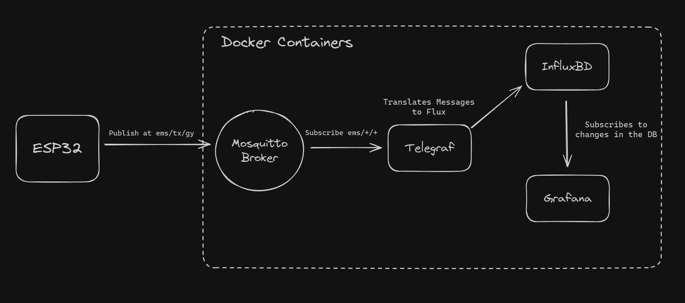

# EMS Final Project

The final project requires each group to publish their results to a database.
For this purpose, InfluxDB will be used as our database.
InfluxDB offers different ways to write to it including an Arduino SDK. 
However, to be more in line with the IoT paradigm, MQTT is going to be used to talk to the database.

## Architecture



The entirity of the backend was implemented using [Docker](https://www.docker.com/) containers.
Each of the "blocks" is one container:
- [Mosquitto](https://mosquitto.org/) is a [MQTT](https://mqtt.org/) broker, responsible for managing publishers and subscribers.
- [Telegraf](https://www.influxdata.com/time-series-platform/telegraf/) is a custom backend for InfluxDB that extends its functionality and connectivity. In this project Telegraf is responsible for subscribing to the data topics and translate the MQTT messages into a syntax understandable by InfluxDB.
- [InfluxDB](https://www.influxdata.com/) is the Database used in this project. It's a time series database optimized for IoT projects.
- [Grafana](https://grafana.com/) is an application to create custom dashboards with multiple connections for different data sources. In this project Grafana will be used to visualize the data present in the DB.

## Message Topic and Format

Despite the great flexibility offered by the used technologies, Telegraf needs a specific syntax to understand the data sent via MQTT.

### Topic

Telegraf subscribes to multiple topics using wildcards. This means that each group will have their own topic to publish at, following this pattern:

```
ems/t{x}/g{y}
```
Where `x` is the number of your shift and `y` is the number of your group.
So if you are in shift 1 and group 4, your topic will be `ems/t1/g4`.

### Format

InfluxDB does not follow the typical table format to store data. In an InfluxDB database data is separated into multiple buckets that can contain multiple measurements of different tags and fields.

- Bucket: Named location where time series data is stored. A bucket can contain multiple measurements.
    - Measurement: Logical grouping for time series data. All points in a given measurement should have the same tags. A measurement contains multiple tags and fields.
        - Tags: Key-value pairs with values that differ, but do not change often. Tags are meant for storing metadata for each point–for example, something to identify the source of the data like host, location, station, etc.
        - Fields: Key-value pairs with values that change over time–for example: temperature, pressure, stock price, etc.
        - Timestamp: Timestamp associated with the data. When stored on disk and queried, all data is ordered by time. This can be set by the user or automatically when writing data.

To accomodate this pattern, the messages published to the MQTT Broker should follow the following format:

```c
// Syntax
<measurement>[,<tag_key>=<tag_value>[,<tag_key>=<tag_value>]] <field_key>=<field_value>[,<field_key>=<field_value>] [<timestamp>]

// Example
myMeasurement,tag1=value1,tag2=value2 fieldKey="fieldValue" 1556813561098000000

// Practical Example
audio,sampling_rate=44100,source=esp32 spl=85,vPeak=2.34,vRMS=1.65

```

The practical example shows an example of a measurment written in the DB in the context of this project. The tags here attempt to encode some metadata like sampling rate and the source, however, this is not the focus of our project and is only optional.
For fields, the example uses SPL, VPeak, and VRMS. These are only part of the example and other fields can be used.