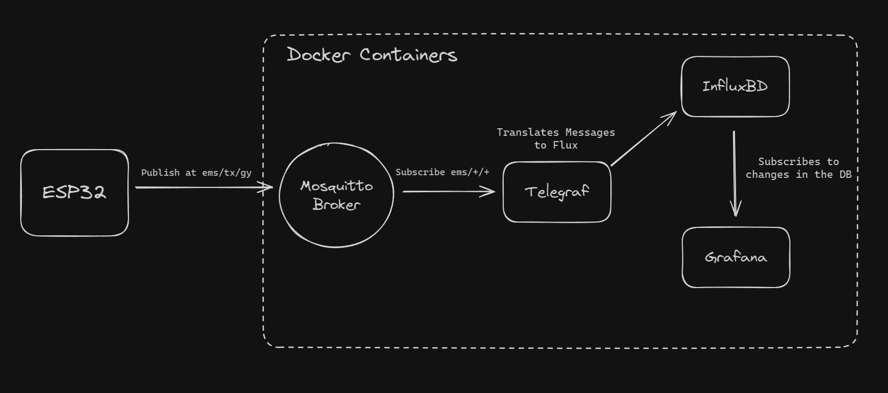
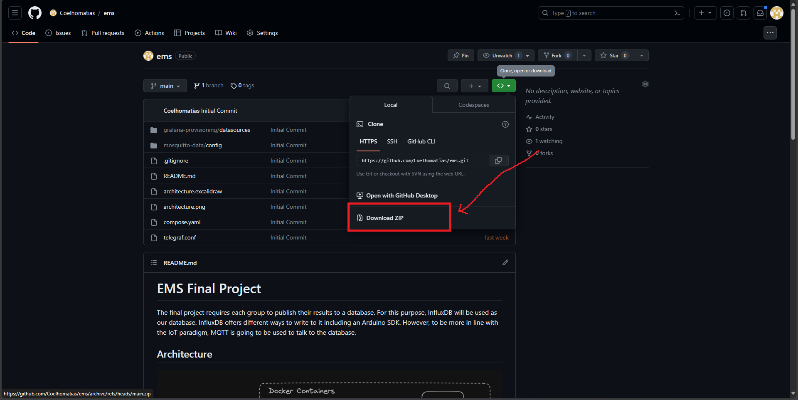
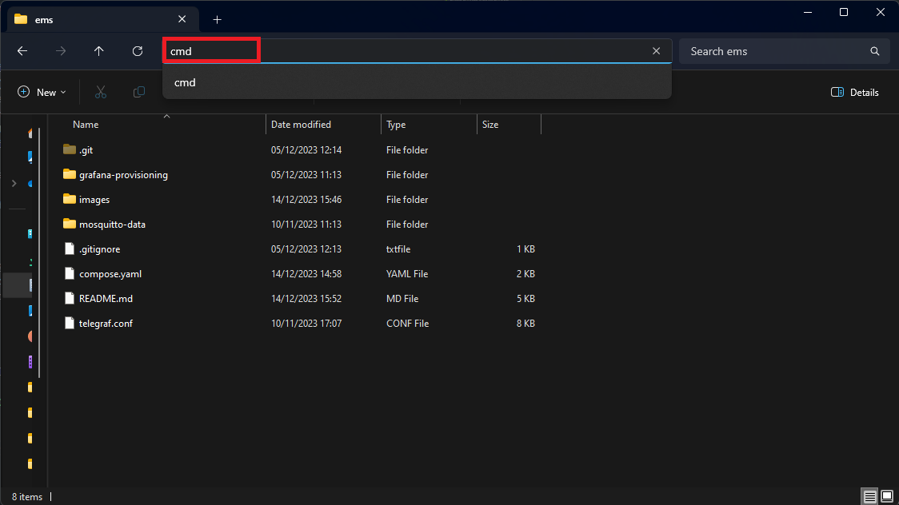
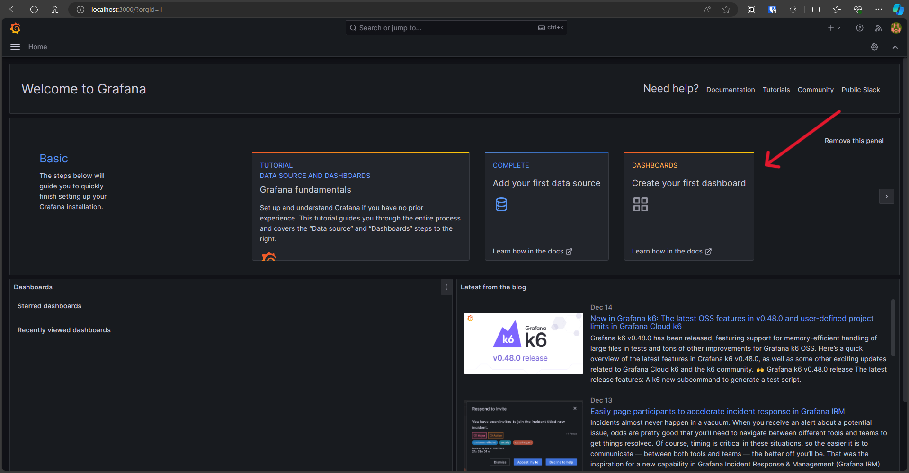
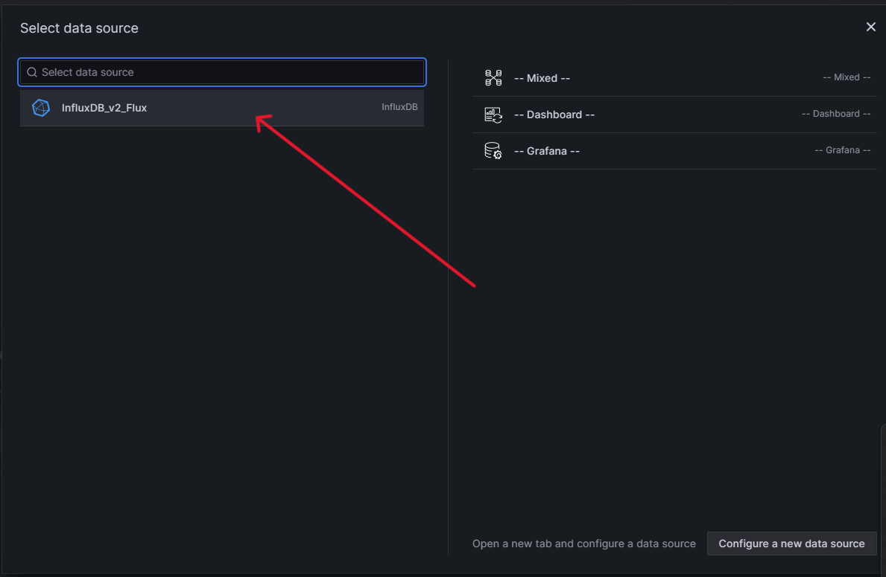
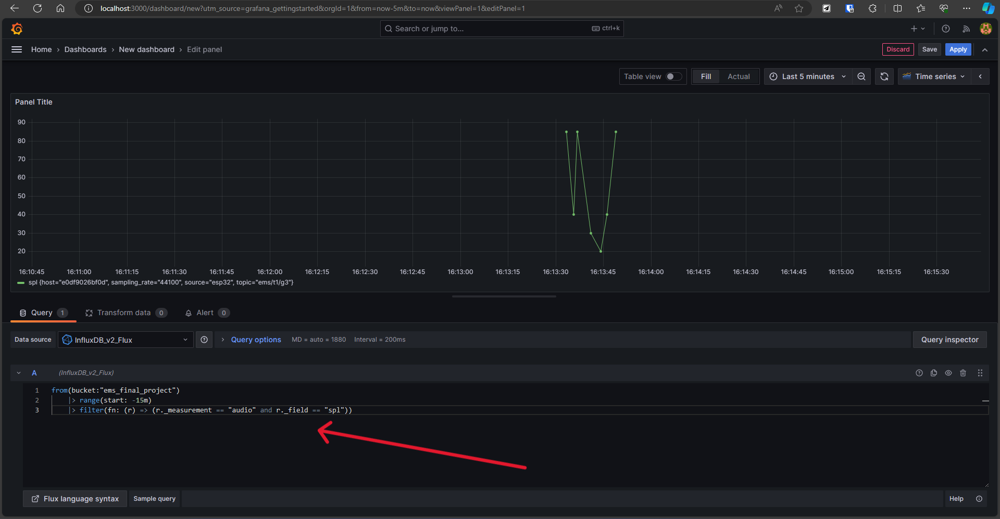
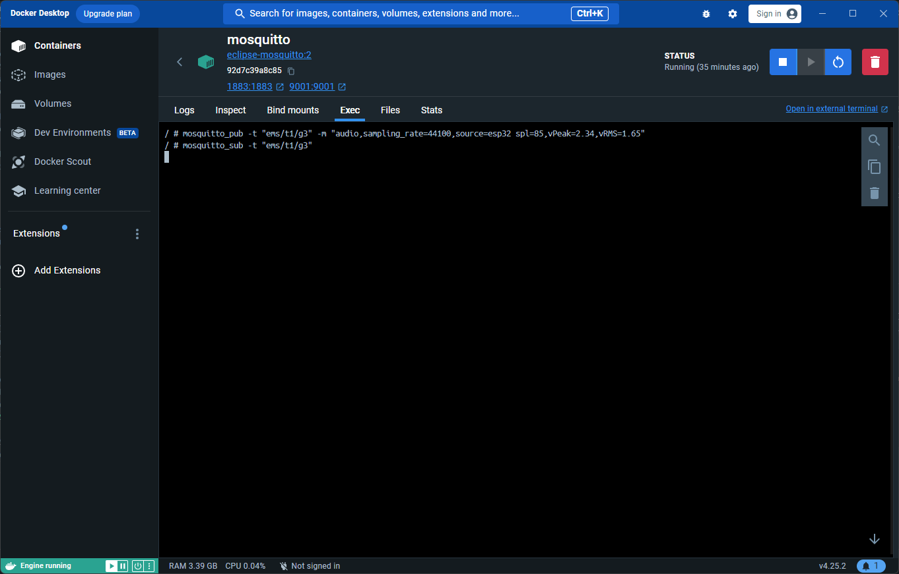

# EMS Final Project

The final project requires each group to publish their results to a database.
For this purpose, InfluxDB will be used as our database.
InfluxDB offers different ways to write to it including an Arduino SDK. 
However, to be more in line with the IoT paradigm, MQTT is going to be used to talk to the database.

## Architecture



The entirity of the backend was implemented using [Docker](https://www.docker.com/) containers.
Each of the "blocks" is one container:
- [Mosquitto](https://mosquitto.org/) is a [MQTT](https://mqtt.org/) broker, responsible for managing publishers and subscribers.
- [Telegraf](https://www.influxdata.com/time-series-platform/telegraf/) is a custom backend for InfluxDB that extends its functionality and connectivity. In this project Telegraf is responsible for subscribing to the data topics and translate the MQTT messages into a syntax understandable by InfluxDB.
- [InfluxDB](https://www.influxdata.com/) is the Database used in this project. It's a time series database optimized for IoT projects.
- [Grafana](https://grafana.com/) is an application to create custom dashboards with multiple connections for different data sources. In this project Grafana will be used to visualize the data present in the DB.

## Installation

Before the installation process, please be sure to have a stable internet connection to avoid enay errors.

### Docker

The first step is to install [Docker Desktop](https://www.docker.com/products/docker-desktop/). Docker is a platform for developing, shipping, and running applications inside lightweight, portable containers. These containers package up an application with all its dependencies, ensuring consistent environment and behavior across different development, testing, and production setups. For this project, all of our backend logic will be contained in containers.

On the first start of Docker Desktop an alert may appear indicating you do not have WSL2 installed. This is no problem, you should install WSL2 as per Docker instructions. After having everything installed, restart Docker Desktop.

### Cloning the Repository

After installing Docker, the next step is to download the backend. The code is hosted in a [GitHub repository](https://github.com/Coelhomatias/ems) and can be clonned using Git, or simply downloaded from GitHub (prefered option if you do not already have Git installed).



Extract this folder to some trusted location in your machine.

### Create the Containers

Navigate to the folder you just extracted and run `cmd` in the nav bar of the explorer to open the terminal in this directory (you can also navigate to this folder in any terminal).



Now inside the terminal, run the command `docker compose up -d` to create and run the containers.

### Navigate and Configure Containers

Most of the configuration is allready done for you but you still have access to the InfluxDB and Grafana GUI. To access the containers all you need is a browser. Open your browser and navigate to the following links and use the corresponding credentials:

- InfluxDB - http://localhost:8086
  - User - user
  - Password - password1234
- Grafana - http://localhost:3000
  - User - admin
  - Password - admin

Grafana will also prompt you to change the password upon login. InfluxDB is your database, here you can make sure your data is reaching your database. 

Grafana will be the main technology you will be working with. You need to create dashboards to visualize your data. You can create and configure whatever dashboards you like, **be creative**!

### Creating a Dashboard in Grafana

Navigate to Grafana and you will be met by a similar screen of the one below. Select "Create your first dashboard".



Next, select "Add visualization".


Now, select "InfluxDB_v2_Flux" as your data source for this visualization.



Now that you have your new visualization, you will need to configure it as you like and query the database for data. The query language used here is Flux, a language exclusive of InfluxDB. The picture below shows an example of a possible query that should work for the majority of groups. However, something much more refined can be achieved with other queries. Please refer to the [documentation](https://docs.influxdata.com/influxdb/v2/query-data/get-started/query-influxdb/) to learn more about the syntax of Flux.




## Message Topic and Format

Despite the great flexibility offered by the used technologies, Telegraf needs a specific syntax to understand the data sent via MQTT.

### Topic

Telegraf subscribes to multiple topics using wildcards. This means that each group will have their own topic to publish at, following this pattern:

```
ems/t{x}/g{y}
```
Where `x` is the number of your shift and `y` is the number of your group.
So if you are in shift 1 and group 4, your topic will be `ems/t1/g4`.

### Format

InfluxDB does not follow the typical table format to store data. In an InfluxDB database data is separated into multiple buckets that can contain multiple measurements of different tags and fields.

- Bucket: Named location where time series data is stored. A bucket can contain multiple measurements.
    - Measurement: Logical grouping for time series data. All points in a given measurement should have the same tags. A measurement contains multiple tags and fields.
        - Tags: Key-value pairs with values that differ, but do not change often. Tags are meant for storing metadata for each point–for example, something to identify the source of the data like host, location, station, etc.
        - Fields: Key-value pairs with values that change over time–for example: temperature, pressure, stock price, etc.
        - Timestamp: Timestamp associated with the data. When stored on disk and queried, all data is ordered by time. This can be set by the user or automatically when writing data.

To accomodate this pattern, the messages published to the MQTT Broker should follow the following format:

```c
// Syntax
<measurement>[,<tag_key>=<tag_value>[,<tag_key>=<tag_value>]] <field_key>=<field_value>[,<field_key>=<field_value>] [<timestamp>]

// Example
myMeasurement,tag1=value1,tag2=value2 fieldKey="fieldValue" 1556813561098000000

// Practical Example
audio,sampling_rate=44100,source=esp32 spl=85,vPeak=2.34,vRMS=1.65

```

The practical example shows an example of a measurment written in the DB in the context of this project. The tags here attempt to encode some metadata like sampling rate and the source, however, this is not the focus of our project and is only optional.
For fields, the example uses SPL, VPeak, and VRMS. These are only part of the example and other fields can be used.

## Test Publisher and Subscriber

To test if your system is running correctly, you can use the Mosquitto container as a publisher and subscriber. To do so, navigate to the "Exec" tab of your Mosquitto container using Docker Desktop and use the `mosquitto_pub` or `mosquitto_sub` to test either a publisher or a subscriber respectively.

```c
// Publish message -m on topic -t
mosquitto_pub -t "ems/t1/g3" -m "audio,sampling_rate=44100,source=esp32 spl=85,vPeak=2.34,vRMS=1.65"

// Subscribe to topic -t
mosquitto_sub -t "ems/t1/g3"
```

